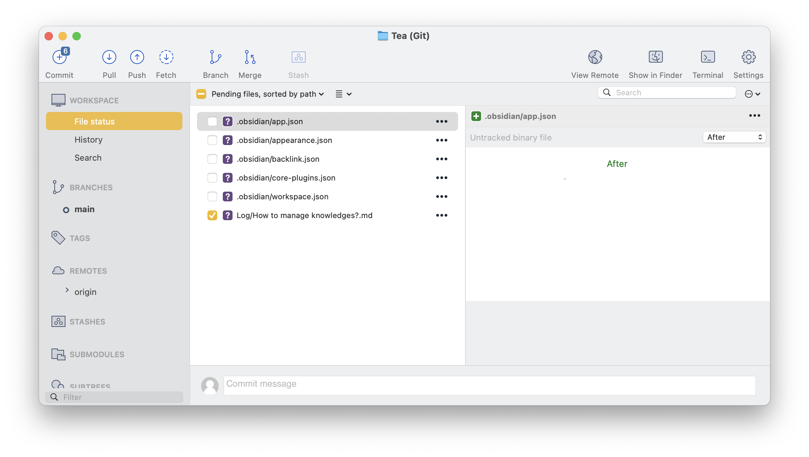

## 背景
在我们启动了我们创作品牌“绿绽”（暂定）项目后，需要一种方式管理我们的知识内容，为了能够让知识进行沉淀，所以设计出现在的知识管理系统。
## 系统介绍
我们的知识管理系统结构如下：
```
.
├── Log
└── knowledge_base
```
### log
log 指的是用于记录我们在这个项目中所尝试的内容，在该分类中的笔记需要遵循以下基本格式：
- 问题描述
- 问题分析
- 尝试解决方法
- 结果（是否解决）
- 其他说明（如有）
- 知识链接
### knowledge_base
知识库是用于存放一些客观的知识内容， 预期是做成类似维基百科一样的形式用于存放概念性知识，如绿茶、红茶等的概念性知识。
在这个分类中暂时没有设置固定的格式。

### 二者联系
在 log 中会有对应联系到知识库中的知识，也就是会产生知识链接。
## 管理流程
我们所有的知识管理都是通过 obsidian + GitHub + notion 完成。
obsidian 负责最初的本地段编写，GitHub 可以用于多人协同，notion 用于最终的知识呈现。
## 其他说明
请注意，在将内容 push 到 origin 的时候，请不要将本地 `.obsidian` 相关内容 push 上去，否则 PR 将**无法合并**！


如上图，请不要将 `.obsidian` 内容 commit 上去！
同时，在提 issue 的时候请不要提到自己 fork 的仓库中，否则无法被查看与 comment！